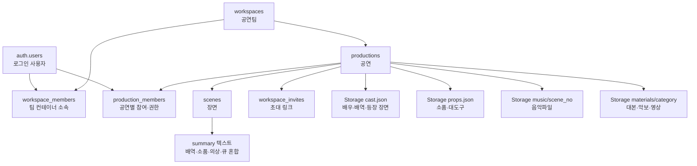
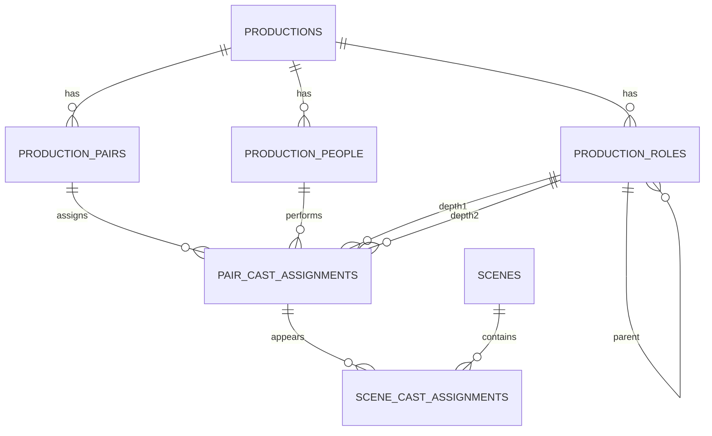

# StageFlow 데이터베이스 구조와 연결 현황

> 이 문서는 현재 legacy 구조를 설명한다. 중복을 제거한 최종 목표 구조는
> [`DATABASE_V4_CLEAN.md`](./DATABASE_V4_CLEAN.md)를 기준으로 한다.

## 1. 현재 상태 요약

| 영역 | 현재 저장 위치 | 앱 연결 상태 | 목표 |
|---|---|---:|---|
| 로그인 | Supabase Auth `auth.users` | 연결됨 | 유지 |
| 공연팀 | `workspaces`, `workspace_members` | 연결됨 | 팀 컨테이너로만 사용 |
| 공연별 참여자 | `production_members` | 신규 마이그레이션 필요 | 공연 접근·초대 권한 기준 |
| 공연 | `productions` | 연결됨 | 유지 |
| 장면 | `scenes` | 연결됨 | 유지 |
| 배우·배역 | Storage `cast.json` | 연결됨 | 관계형 테이블로 이전 |
| 소품·대도구 | Storage `props.json` + `scenes.summary` | 연결됨 | 관계형 테이블로 이전 |
| 의상·큐 | `scenes.summary` 텍스트 | 연결됨 | 관계형 테이블로 이전 |
| 음악·자료 | Storage 폴더 | 연결됨 | 메타데이터 테이블 추가 예정 |
| 페어별 캐스팅 | 신규 SQL만 작성됨 | **아직 앱 미연결** | 신규 테이블 실행·연결 필요 |

`supabase/pairs_cast_schema.sql`은 기존 DB를 삭제하지 않는 추가 마이그레이션이다. GitHub에는 반영됐지만 Supabase SQL Editor에서 실행해야 실제 테이블이 생성된다.

## 2. 현재 실제 데이터 연결



### 현재 관계형 테이블

#### `workspaces`

공연팀 단위 최상위 공간이다.

- `id`: PK
- `name`: 팀 이름
- `created_by`: 생성 사용자
- `created_at`: 생성일

#### `workspace_members`

사용자와 공연팀을 연결한다.

- `workspace_id` → `workspaces.id`
- `user_id` → `auth.users.id`
- `role`: 팀 권한

한 사용자가 여러 공연팀에 참여할 수 있다. 이 테이블만으로는 공연 접근 권한을 주지 않으며, 앱에서 소속 작업공간을 찾기 위한 컨테이너 관계로 사용한다.

#### `production_members`

사용자가 실제로 접근할 수 있는 공연을 연결한다.

- `production_id` → `productions.id`
- `user_id` → `auth.users.id`
- `role`: `owner`, `editor`, `member`
- `invited_by`, `joined_at`

초대 링크는 반드시 하나의 `production_id`를 가지며, 참가해도 다른 공연의 `production_members`에는 추가되지 않는다. 공연 목록·장면·자료실·팀원 목록·삭제 승인은 모두 이 테이블을 기준으로 제한한다.

#### `productions`

공연 기본정보다.

- `id`: PK
- `workspace_id` → `workspaces.id`
- `created_by` → `auth.users.id`
- `title`: 공연명
- `venue`: 장소
- `performance_start_date`: 공연일

#### `scenes`

공연의 장면·넘버 순서다.

- `id`: PK
- `production_id` → `productions.id`
- `act_no`: ACT
- `scene_no`: 장면·넘버 번호
- `sort_order`: 정렬 순서
- `title`: 장면·넘버 제목
- `summary`: 현재 배역·앙상블·소품·의상·큐가 섞여 있는 텍스트

#### `workspace_invites`

- `workspace_id` → `workspaces.id`
- `production_id` → `productions.id`
- `token`: 초대 토큰
- `created_by` → `auth.users.id`
- `expires_at`, `uses`, `max_uses`

## 3. 현재 Storage 연결

버킷: `stageflow-files`

```text
{workspace_id}/{production_id}/
├─ data/
│  ├─ cast.json
│  ├─ props.json
│  ├─ readiness.json
│  ├─ show-cursor.json
│  ├─ show-log.json
│  └─ run-log.json
├─ imports/
├─ music/{scene_no}/
└─ materials/{category}/
```

### `cast.json`

```json
{
  "members": [
    {
      "id": "uuid",
      "name": "실제 배우 이름",
      "roleName": "1Depth 배역",
      "subRoleName": "2Depth 배역",
      "type": "주연 또는 앙상블",
      "sceneNumbers": [1, 2, 5],
      "userId": "로그인 계정 uuid"
    }
  ]
}
```

현재 배우 탭·팀원 배역선택·공연모드는 이 파일을 읽는다. 동시수정 충돌, 페어별 배정, 관계 검색에 취약하다.

### `props.json`

```json
{
  "items": [
    {
      "id": "uuid",
      "kind": "소품",
      "name": "곤봉",
      "sceneNo": 2,
      "inBy": "잭",
      "outBy": "다더",
      "note": "",
      "ready": false
    }
  ]
}
```

## 4. 신규 페어·배우·배역 구조



### `production_pairs`

공연별 페어다.

- `id`
- `production_id`
- `name`: A페어, B페어, 언더스터디
- `sort_order`, `is_active`

### `production_people`

실제 사람을 한 번만 저장한다.

- `id`
- `production_id`
- `user_id`: 가입 계정 연결, 미가입이면 NULL
- `display_name`: 실제 배우 이름

### `production_roles`

1Depth와 2Depth를 계층으로 저장한다.

- `id`
- `production_id`
- `parent_role_id`: 2Depth일 때 1Depth 배역 ID
- `depth`: 1 또는 2
- `name`
- `role_type`: 주연·조연·앙상블·배역

예시:

```text
앙상블 (depth=1)
├─ 경찰 (depth=2)
├─ 기자 (depth=2)
└─ 시민 (depth=2)
```

### `pair_cast_assignments`

페어·배우·배역을 연결하는 핵심 테이블이다.

- `pair_id`
- `person_id`
- `role_depth1_id`
- `role_depth2_id`: 없으면 NULL
- `is_primary`, `note`

같은 배우가 한 페어에서 복수 배역을 가지거나, 페어마다 다른 배역을 맡을 수 있다.

### `scene_cast_assignments`

캐스팅과 장면을 연결한다.

- `scene_id`
- `pair_cast_assignment_id`
- `appearance_type`: 메인·등장·백·대기
- `entrance_note`, `exit_note`

### `production_cast_matrix`

앱에서 복잡한 JOIN 없이 아래 결과를 한 번에 읽는 뷰다.

```text
공연 | 페어 | 배우 이름 | 1Depth | 2Depth | 대표배역 여부
```

## 5. 목표 화면별 연결

| 화면 | 읽을 데이터 | 쓸 데이터 |
|---|---|---|
| 홈 | `productions`, `scenes` | 기본 공연은 localStorage |
| 배우 | people + roles + pair assignments | 배우·배역·페어 배정 |
| 장면 | scenes + scene cast assignments | 장면별 등장 연결 |
| 준비/공연 | 선택 pair + scene assignments | 회차 준비상태·GO 기록 |
| 팀원 초대 | invites + people.user_id | 가입 계정과 배우 연결 |
| 자동정리 | PDF/표 후보 | roles·people·scene assignments 병합 |

## 6. 이전 순서

1. `production_scoped_access.sql`을 Supabase에서 실행
2. `pairs_cast_schema.sql`을 Supabase에서 실행
2. 앱에 신규 테이블 읽기 기능 추가
3. `cast.json` → people·roles·assignments 변환
4. 배우 화면에서 기존 JSON과 신규 DB 결과 비교
5. 페어 선택과 장면 연결을 신규 DB 기준으로 전환
6. 검증 후 `cast.json` 쓰기를 중단하고 백업 읽기만 유지

지금은 1번도 사용자가 Supabase에서 실행해야 하며, 앱은 아직 신규 페어 테이블을 사용하지 않는다.
