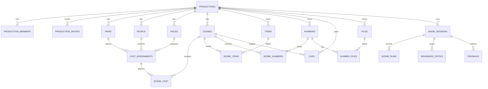

# StageFlow DB v4 — 정리된 목표 구조

## 원칙

1. `productions`가 모든 데이터의 최상위다.
2. 사용자는 `production_members`에 있을 때만 해당 공연을 본다.
3. 배우(사람), 배역, 페어는 서로 다른 데이터다.
4. 장면에는 문자열 요약을 복제하지 않고 연결 관계만 저장한다.
5. 소품·의상·넘버·큐는 각각 한 번만 저장하고 장면에 연결한다.
6. 원본 파일은 Storage에, 검색 가능한 메타데이터는 `files`에 저장한다.
7. 공연 회차마다 준비 상태와 런 기록을 새로 만든다.
8. `cast.json`, `props.json`, `scenes.summary`는 마이그레이션 중 읽기 전용으로만 유지한다.

## 핵심 관계

## 테이블별 책임

### 공연과 권한

| 테이블 | 책임 |
|---|---|
| `productions` | 공연 기본정보 |
| `production_members` | 공연별 사용자 권한. 다른 공연에 절대 상속하지 않음 |
| `production_invites` | 특정 공연 하나의 초대 토큰 |

`workspaces`, `workspace_members`, `workspace_invites`는 호환 기간에만 남기고 앱에서 읽지 않는다.

### 배우·배역·페어

| 테이블 | 책임 |
|---|---|
| `people` | 실제 배우 한 명 |
| `roles` | 배역. `parent_role_id`로 1Depth/2Depth 표현 |
| `pairs` | A페어, B페어 등 |
| `cast_assignments` | 페어 + 배우 + 배역 연결 |
| `scene_cast` | 캐스팅이 어느 장면에 어떤 형태로 등장하는지 연결 |

배우 이름을 배역 문자열에 섞지 않는다. 예: `경찰 (잭)`은 `roles=경찰`, `people=잭`, `cast_assignments` 연결로 저장한다.

### 장면과 공연 데이터

| 테이블 | 책임 |
|---|---|
| `scenes` | ACT·순서·장면명·메모 |
| `items` | 소품·대도구·의상을 공통 자산으로 등록 |
| `scene_items` | 장면별 사용, IN/OUT 담당 배역, 준비 메모 |
| `numbers` | 넘버의 정식 이름·번호 |
| `scene_numbers` | 한 장면의 복수 넘버 및 순서 |
| `cues` | 조명·음향·영상·액션 큐 |

`items.kind`는 `prop`, `set`, `costume`만 사용한다. 준비 상태는 자산 자체가 아니라 공연 회차별 `readiness_states`에 저장한다.

### 파일과 자동정리

| 테이블 | 책임 |
|---|---|
| `files` | Storage 경로, 원본명, 종류, 크기, 업로드 사용자 |
| `number_files` | 한 넘버에 여러 음악·악보 파일 연결 |
| `import_batches` | PDF/OCR/표 분석 1회 작업 |
| `import_candidates` | 자동 분석 후보와 신뢰도, 적용 여부 |

자동정리는 바로 본 테이블을 덮어쓰지 않는다. `import_candidates`에서 사용자가 확인한 항목만 신규 추가 또는 병합한다.

### 준비/공연과 피드백

| 테이블 | 책임 |
|---|---|
| `show_sessions` | 리허설·공연 한 회차 |
| `scene_runs` | GO 시점과 장면별 실제 런타임 |
| `readiness_states` | 회차별 배우·소품·의상 준비 상태 |
| `feedback` | 런 종료 후 특정 배우에게만 전달되는 피드백 |

새 `show_session`을 만들면 준비 상태는 빈 상태로 시작하므로 회차마다 자동 초기화된다.

## 화면별 데이터 연결

| 화면 | 기준 테이블 |
|---|---|
| 개요 | productions, scenes, show_sessions |
| 장면 | scenes + scene_cast + scene_items + scene_numbers + cues |
| 배우 | people + roles + pairs + cast_assignments |
| 준비/공연 | show_sessions + scene_runs + readiness_states |
| 더보기/자료 | files + import_batches + import_candidates |
| 팀원 초대 | production_members + production_invites |

## 제거할 중복

- `scenes.summary` 안의 배우·소품·의상·큐 문자열
- Storage의 `cast.json`, `props.json`, `readiness.json`, `show-log.json`, `run-log.json`
- `workspace_members`를 공연 접근 권한으로 사용하는 코드
- 동일한 배우 이름을 배역별로 여러 번 저장하는 구조
- 음악 파일을 장면 번호 폴더만으로 연결하는 구조

## 안전한 이전 순서

1. v4 테이블 생성 — 기존 테이블과 JSON은 유지
2. 기존 `cast.json`, `props.json`, `scenes.summary`를 v4 후보 데이터로 변환
3. 관리자 확인 후 관계형 테이블에 저장
4. 앱 읽기를 v4 우선, 기존 JSON fallback으로 전환
5. 일정 기간 비교 검증
6. 기존 JSON 쓰기 중단
7. 백업 후 legacy 테이블·컬럼 제거

라이브 데이터가 있으므로 7단계 전에는 `drop table`, `drop column`을 실행하지 않는다.
